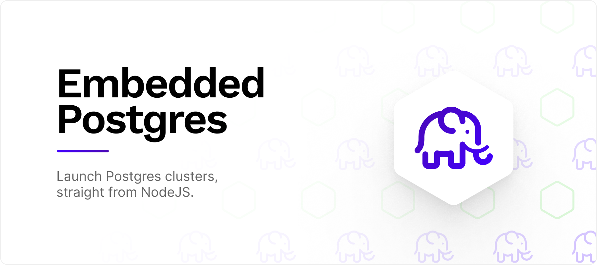

<div align="center">


</div>

<h3 align="center">
    🐘 A Node package that spawns PostgresQL clusters programatically.
</h3>

## Installation
`embedded-postgres` is available from NPM:

```sh
npm i embedded-postgres
```

<br />

## Usage
This package contains a simple API that allows you to create clusters, start
them, create / delete database and stop any existing processes.

```ts
import EmbeddedPostgres from 'embedded-postgres';

async function main() {
    // Create the object
    const pg = new EmbeddedPostgres({
        data_dir: './data/db',
        user: 'postgres',
        password: 'password',
        port: 5432,
        persistent: true,
    });

    // Create the cluster config files
    await pg.inititialize();

    // Start the server
    await pg.start();

    // Create and/or drop database
    await pg.createDatabase('TEST');
    await pg.dropDatabase('TEST');

    // Initialize a node-postgres client
    const client = pg.getPgClient();
    await client.connect();
    const result = await client.query('SELECT datname FROM pg_database');

    // Stop the server
    await pg.stop();
}

main();
```

<br />

## PostgresQL Versions
This package aims to track the [PostgresQL support
policy](https://www.postgresql.org/support/versioning/) for supported versions.
Additionally, we track the binaries that are created upstream in [zonky's
embedded-postgres-binaries](https://github.com/zonkyio/embedded-postgres). This
leads to the following current support matrix:

| Platform / Architecture | 11.20.0 | 12.15.0 | 13.11.0 | 14.8.0 |  15.3.0 |
|---|---|---|---|---|---|
| 🍎 Darwin / x64 |  ✅ |  ✅ |  ✅ |  ✅ |  ✅ |
| 🍎 Darwin / arm64[[1]](https://github.com/zonkyio/embedded-postgres/issues/86#issuecomment-1120425822) | 🚫 |  🚫 |  🚫 |  🚫 |  ✅ |  ✅ |
| 🪟 Windows / x64 |  ✅ |  ✅ |  ✅ |  ✅ |  ✅ |
| 🐧 Linux / x64 |  ✅ |  ✅ |  ✅ |  ✅ |  ✅ |
| 🐧 Linux / arm |  ✅ |  ✅ |  ✅ |  ✅ |  ✅ |
| 🐧 Linux / arm64 |  ✅ |  ✅ |  ✅ |  ✅ |  ✅ |
| 🐧 Linux / ia32 |  ✅ |  ✅ |  ✅ |  ✅ |  ✅ |
| 🐧 Linux / ppc64 |  ✅ |  ✅ |  ✅ |  ✅ |  ✅ |

In order to install a particular version, look for the latest tag in
[NPM](https://www.npmjs.com/package/embedded-postgres). For example, if you
would like to install `v10.20.0`, you can currently use the following tag:
```sh
npm i embedded-postgres@10.20.0-beta.6
```

Installing particular versions of PostgresQL (i.e. versions not released on NPM)
is currently not possible. If you would have a need for doing so, please create
an issue.

<br />

## Contributing
This package is open to issues, feedback, ideas and pull requests. Create an
issue on this repository to get started!

<br />

## Credits and Licensing
Embedded Postgres was created by Lei Nelissen for [BMD
Studio](https://bmd.studio). It is based on [zonky's
embedded-postgres-binaries](https://github.com/zonkyio/embedded-postgres). The
binaries are made available under the Apache License 2.0, whereas the specific
code in this package is made available under the MIT license.

<a href="https://bmd.studio">
    
</a>

<br />